metallicaRt
================

<!-- badges: start -->

[](https://travis-ci.com/johnmackintosh/metallicaRt)
<!-- badges: end -->

# 

## What?

On a whim, this is a collection of colour palettes based on Metallica
album covers.

Each is named using an abbreviation of the relevant album.

## Why?

Because I saw [this
post](https://github.com/annahensch/R-tutorials/blob/master/ggplot-on-fire.md)
on Twitter

## But still, …why?

Because I’d already created a bunch of palettes manually for [this post
on my
blog](https://johnmackintosh.net/blog/2018-01-29-hardwired-for-tidy-text/)

## How?

I produced the palettes with 7 colours using an online tool, when I
produced my blog post originally. I also put together the ‘combo’
palette.

Palettes that end with ‘10’ were created using
[colorfindr](https://CRAN.R-project.org/package=colorfindr)

## Credit

Thanks to Kelly Cotton for [the nycpalettes
package](https://github.com/kellycotton/nycpalettes) which this was
extremely heavily based on

## I need this in my life

Of course you do. This will not go to CRAN, so please install using the
remotes package.

``` r
#library(remotes)
#remotes::install_github("johnmackintosh/metallicaRt")
library(metallicaRt)
#> Warning: replacing previous import 'vctrs::data_frame' by 'tibble::data_frame'
#> when loading 'dplyr'
```

## Data Viz Friendly

These mini palettes *might* actually be useful.

All named after a song title from the relevant album

``` r
metalli_palette("whiplash")
```

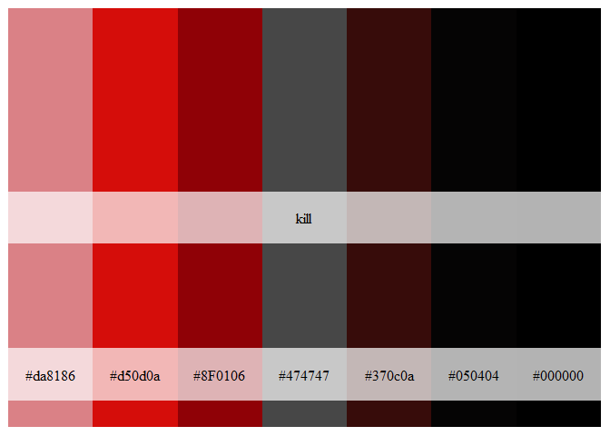<!-- -->

``` r
metalli_palette("bells")
```

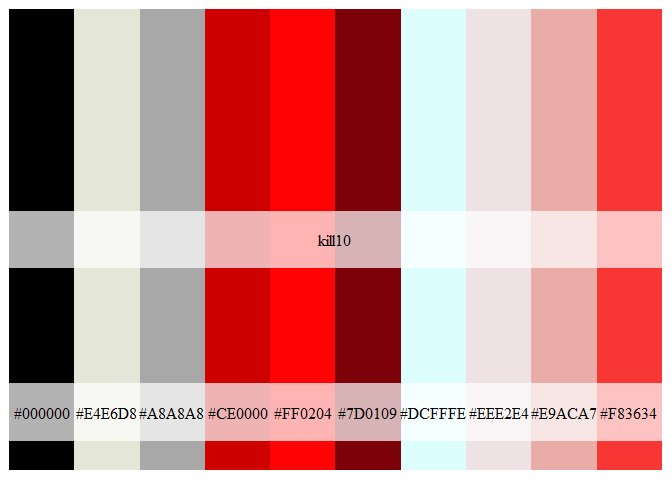<!-- -->

``` r
metalli_palette("orion")
```

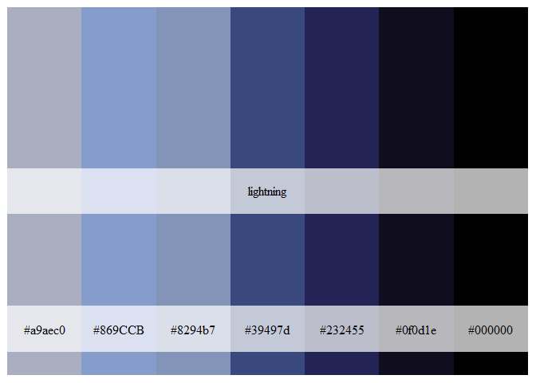<!-- -->

``` r
m <- outer(1:20,1:20,function(x,y) sin(sqrt(x*y)/3))
cols <- metalli_palette("orion")
Lab.palette <- colorRampPalette(cols,space = "Lab")
filled.contour(m, col = Lab.palette(20))
```

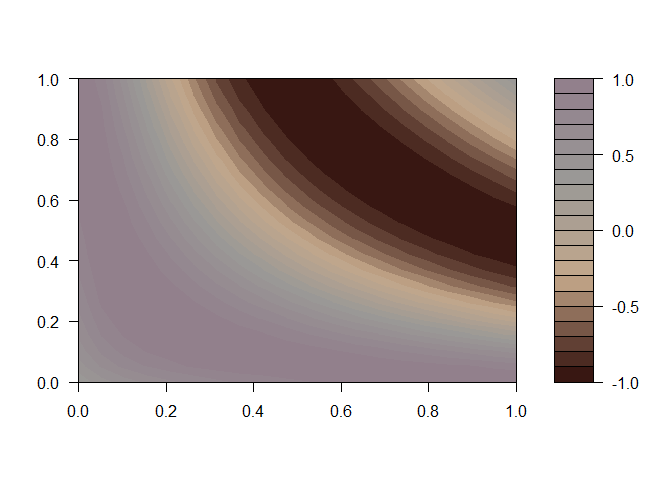<!-- -->

``` r
metalli_palette("blackened")
```

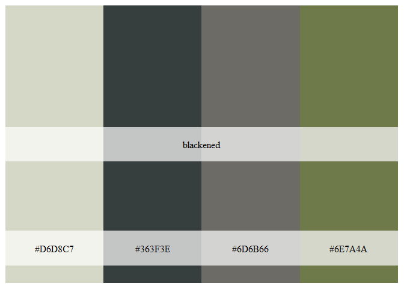<!-- -->

``` r
metalli_palette("roam")
```

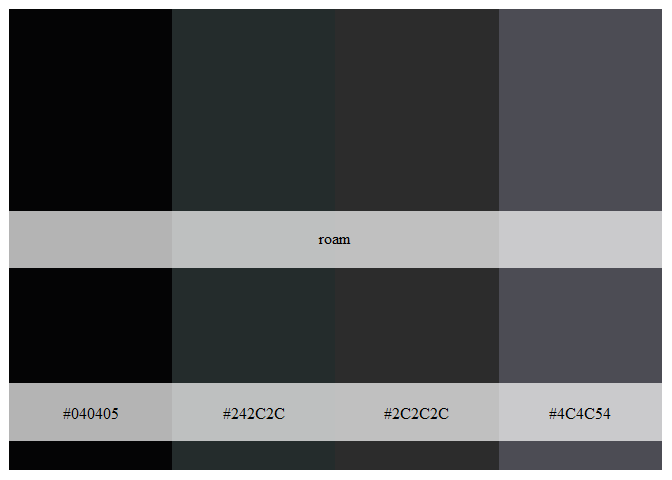<!-- -->

``` r
metalli_palette("bleeding")
```

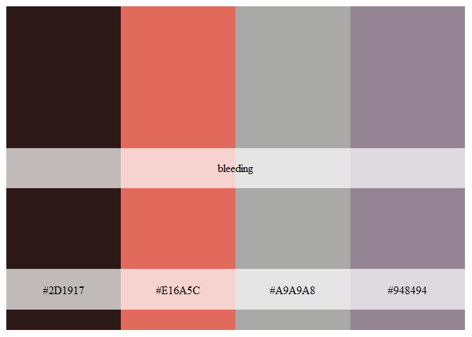<!-- -->

``` r
cols <- metalli_palette("bleeding")
Lab.palette <- colorRampPalette(cols,space = "Lab")
filled.contour(m, col = Lab.palette(20))
```

<!-- -->

``` r
metalli_palette("fuel")
```

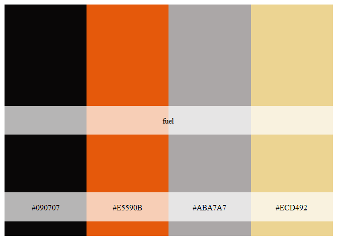<!-- -->

``` r
metalli_palette("frantic")
```

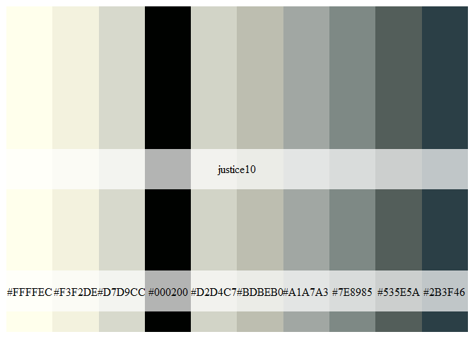<!-- -->

``` r
metalli_palette("scarred")
```

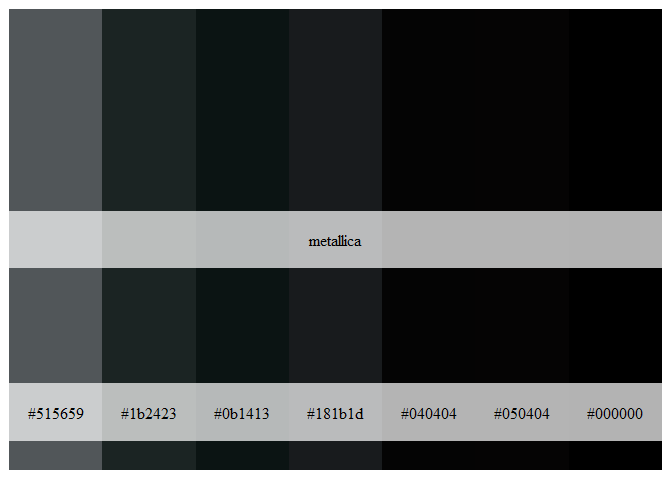<!-- -->

``` r
metalli_palette("revenge")
```

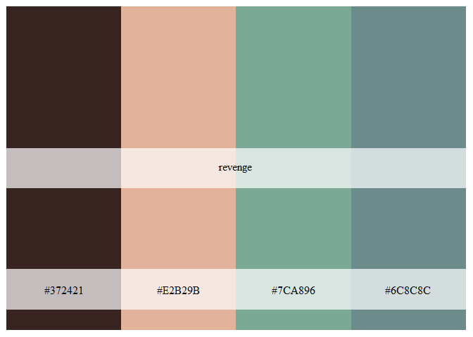<!-- -->

``` r
cols <- metalli_palette("revenge")
Lab.palette <- colorRampPalette(cols,space = "Lab")
filled.contour(m, col = Lab.palette(20))
```

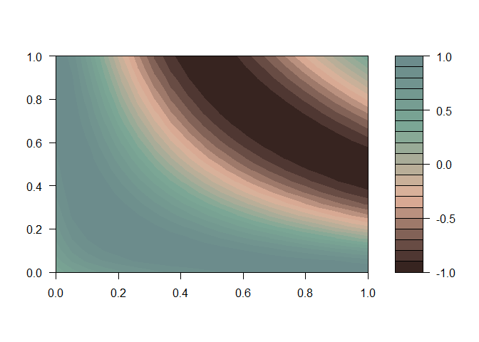<!-- -->

## Gimme fuel, gimme fire, longer palettes I desire

OK then.

These contain more album specific colors, but might be of less practical
use for data visualisation purposes.

# Kill ’Em All

``` r
metalli_palette("kill")
```

<!-- -->

``` r
scales::show_col(killem_pal()(10))
```

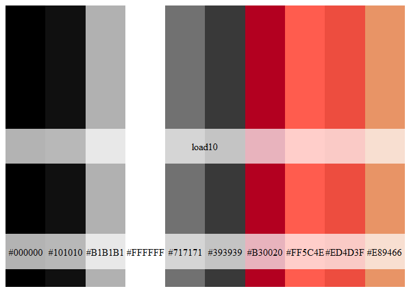<!-- -->

## Ride The Lightning

``` r
metalli_palette("rtl")
```

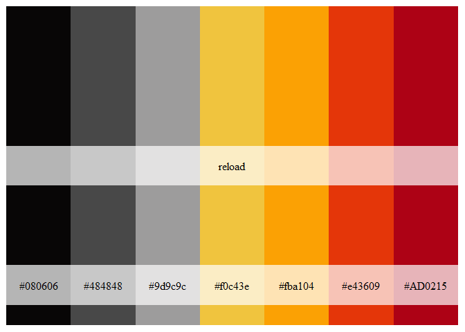<!-- -->

``` r
scales::show_col(lightning_pal()(10))
```

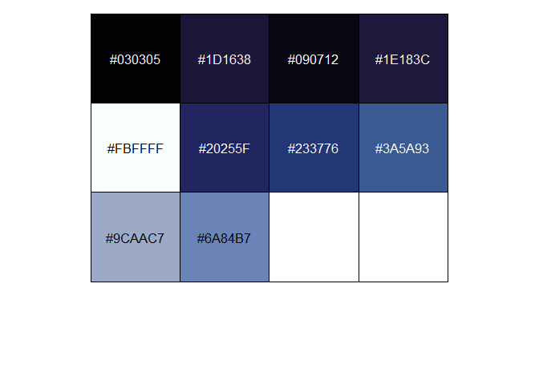<!-- -->

## Master of Puppets

``` r
metalli_palette("puppets")
```

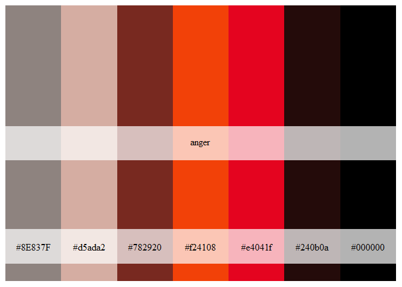<!-- -->

``` r
scales::show_col(puppets_pal()(10))
```

<!-- -->

## …And Justice For All

``` r
metalli_palette("justice")
```

<!-- -->

``` r
scales::show_col(justice_pal()(10))
```

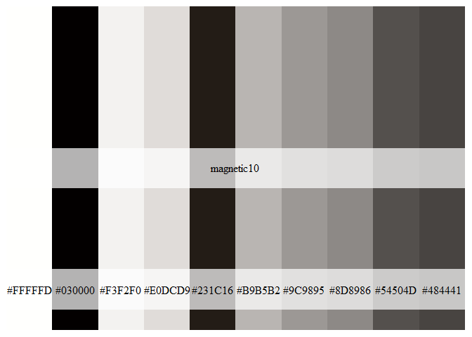<!-- -->

## Metallica

How much more black could it be?

``` r
metalli_palette("metallica")
```

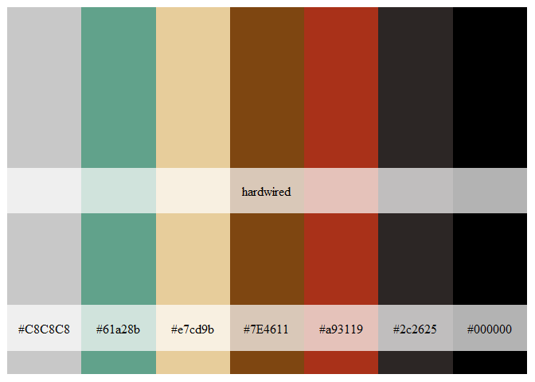<!-- -->

``` r
scales::show_col(metallica_pal()(10))
```

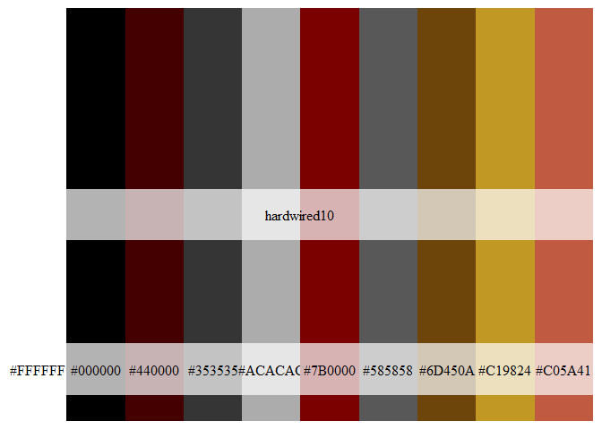<!-- -->

## Load

Under-rated

``` r
metalli_palette("load")
```

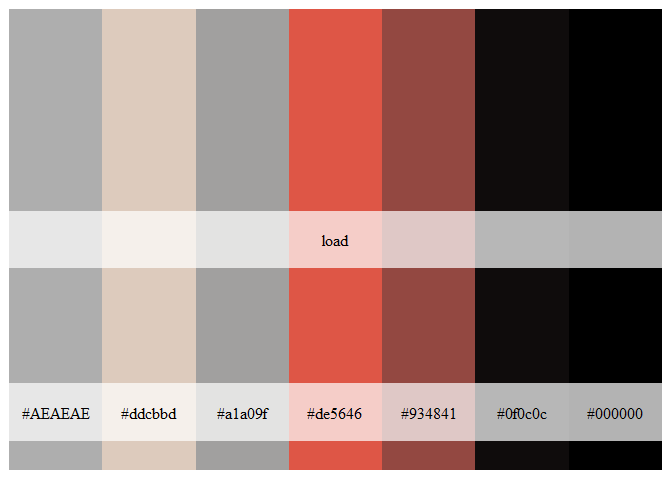<!-- -->

``` r
metalli_palette("load10")
```

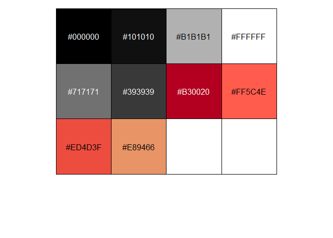<!-- -->

## Reload

``` r
metalli_palette("reload")
```

<!-- -->

``` r
metalli_palette("reload10")
```

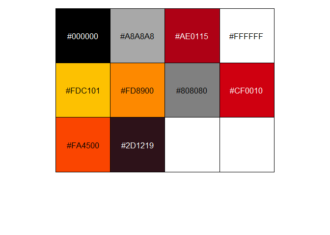<!-- -->

## St. Anger

``` r
metalli_palette("anger")
```

<!-- -->

``` r
metalli_palette("anger10")
```

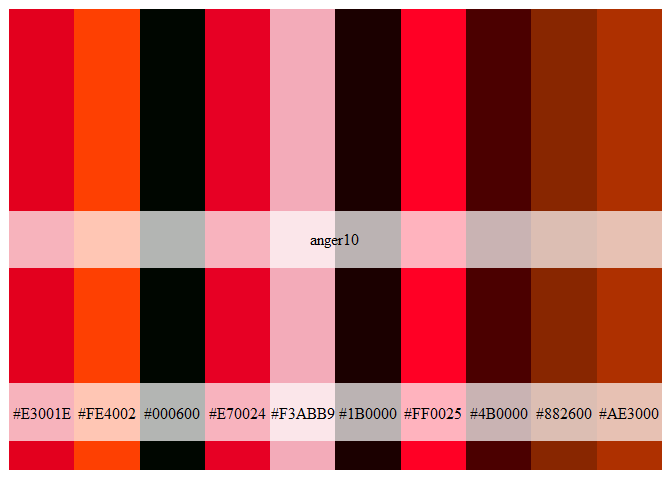<!-- -->

## Death Magnetic

``` r
metalli_palette("magnetic")
```

<!-- -->

``` r
metalli_palette("magnetic10")
```

<!-- -->

## Hardwired…To Self Destruct

``` r
metalli_palette("hardwired")
```

<!-- -->

``` r
metalli_palette("hardwired10")
```

<!-- -->

## Metal up your palette

``` r
metalli_palette("combo")
```

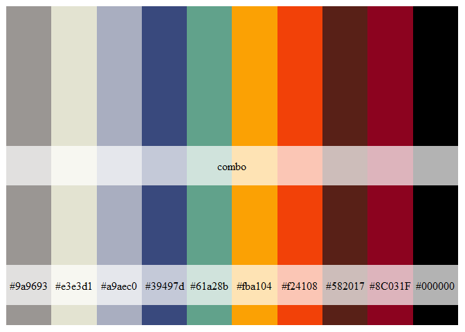<!-- -->
