metallicaRt
================

<!-- badges: start -->


<!-- badges: end -->

# 

## What?

On a whim, this is a collection of colour palettes based on Metallica
album covers.

Each is named using an abbreviation of the relevant album.

## Why?

Because I saw [this
post](https://github.com/annahensch/R-tutorials/blob/master/ggplot-on-fire.md)
on Twitter

## But still, …why?

Because I’d already created a bunch of palettes manually for [this post
on my
blog](https://johnmackintosh.net/blog/2018-01-29-hardwired-for-tidy-text/)

## How?

I produced the palettes with 7 colours using an online tool, when I
produced my blog post originally. I also put together the ‘combo’
palette.

Palettes that end with ‘10’ were created using
[colorfindr](https://CRAN.R-project.org/package=colorfindr)

## Credit

Thanks to Kelly Cotton for [the nycpalettes
package](https://github.com/kellycotton/nycpalettes) which this was
extremely heavily based on

## I need this in my life

Of course you do. This will not go to CRAN, so please install using the
remotes package.

``` r
#library(remotes)
#remotes::install_github("johnmackintosh/metallicaRt")
library(metallicaRt)
#> Warning: replacing previous import 'vctrs::data_frame' by 'tibble::data_frame'
#> when loading 'dplyr'
```

## Data Viz Friendly

These mini palettes *might* actually be useful.

All named after a song title from the relevant album

``` r
metalli_palette("whiplash")
metalli_palette("bells")
metalli_palette("orion")
metalli_palette("blackened")
```


``` r
metalli_palette("roam")
metalli_palette("bleeding")
metalli_palette("fuel")
```


``` r
metalli_palette("frantic")
metalli_palette("scarred")
metalli_palette("revenge")
```


## Gimme fuel, gimme fire, longer palettes I desire

OK then.

These contain more album specific colors, but might be of less practical
use for data visualisation purposes.

# Kill ’Em All

``` r
metalli_palette("kill")
scales::show_col(killem_pal()(10), labels = FALSE)
```

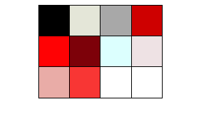

## Ride The Lightning

``` r
metalli_palette("rtl")
scales::show_col(lightning_pal()(10), labels = FALSE)
```

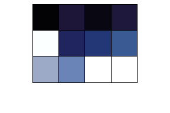

## Master of Puppets

``` r
metalli_palette("puppets")
scales::show_col(puppets_pal()(10), labels = FALSE)
```

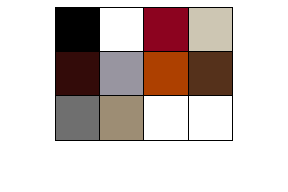

## …And Justice For All

``` r
metalli_palette("justice")
scales::show_col(justice_pal()(10), labels = FALSE)
```

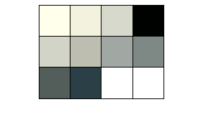

## Metallica

How much more black could it be? Don’t use this.

``` r
metalli_palette("metallica")
scales::show_col(metallica_pal()(10), labels = FALSE)
```

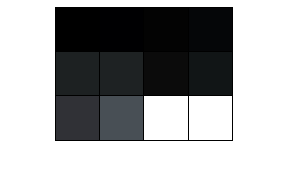

## Load

``` r
metalli_palette("load")
scales::show_col(load_pal()(10), labels = FALSE)
```

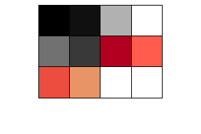

## Reload

``` r
metalli_palette("reload")
scales::show_col(reload_pal()(10), labels = FALSE)
```

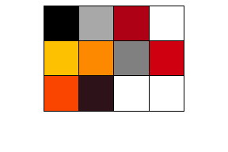

## St. Anger

``` r
metalli_palette("anger")
scales::show_col(anger_pal()(10), labels = FALSE)
```

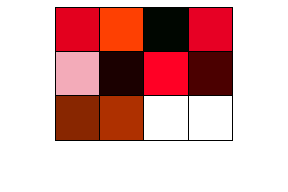

## Death Magnetic

``` r
metalli_palette("magnetic")
scales::show_col(magnetic_pal()(10), labels = FALSE)
```

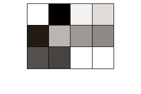

## Hardwired…To Self Destruct

``` r
metalli_palette("hardwired")
scales::show_col(hardwired_pal()(10), labels = FALSE)
```

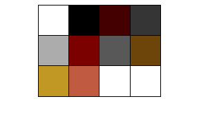

## Metal up your palette

Various colours pilfered from various palettes

``` r
scales::show_col(combo_pal()(10), labels = FALSE)
```

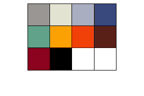
