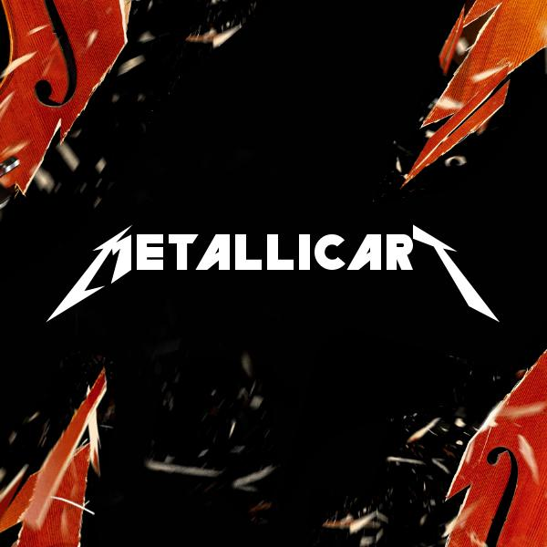
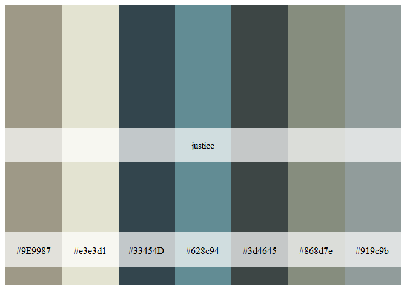

metallicaRt
================

<!-- badges: start -->

[](https://travis-ci.com/johnmackintosh/metallicaRt)
<!-- badges: end -->

# 

## What?

On a whim, this is a collection of colour palettes based on Metallica
album covers.

## Why?

Because I saw [this
post](https://github.com/annahensch/R-tutorials/blob/master/ggplot-on-fire.md)
on Twitter

## But still, …why?

Because I’d already created a bunch of palettes manually for [this post
on my
blog](https://johnmackintosh.net/blog/2018-01-29-hardwired-for-tidy-text/)

## Credit

Thanks to Kelly Cotton for [the nycpalettes
package](https://github.com/kellycotton/nycpalettes) which this was
extremely heavily based on

## I need this in my life

Of course you do

``` r
#library(remotes)
#remotes::install_github("johnmackintosh/metallicaRt")
library(metallicaRt)
```

# Kill ’Em All

``` r
metalli_palette("kill")
```

<!-- -->

``` r
metalli_palette("kill10")
```

<!-- -->

## Ride The Lightning

``` r
metalli_palette("lightning")
```

<!-- -->

``` r
metalli_palette("lightning10")
```

<!-- -->

## Master of Puppets

``` r
metalli_palette("puppets")
```

<!-- -->

``` r
metalli_palette("puppets10")
```

<!-- -->

## …And Justice For All

``` r
metalli_palette("justice")
```

<!-- -->

``` r
metalli_palette("justice10")
```

<!-- -->

## Metallica

How much more black could it be?

``` r
metalli_palette("metallica")
```

<!-- -->

``` r
metalli_palette("metallica10")
```

<!-- -->

## Load

Under-rated

``` r
metalli_palette("load")
```

<!-- -->

``` r
metalli_palette("load10")
```

<!-- -->

## Reload

``` r
metalli_palette("reload")
```

<!-- -->

``` r
metalli_palette("reload10")
```

<!-- -->

## St. Anger

``` r
metalli_palette("anger")
```

<!-- -->

``` r
metalli_palette("anger10")
```

<!-- -->

## Death Magnetic

``` r
metalli_palette("magnetic")
```

<!-- -->

``` r
metalli_palette("magnetic10")
```

<!-- -->

## Hardwired…To Self Destruct

``` r
metalli_palette("hardwired")
```

<!-- -->

``` r
metalli_palette("hardwired10")
```

<!-- -->

## Killer combo

``` r
metalli_palette("combo")
```

<!-- -->
